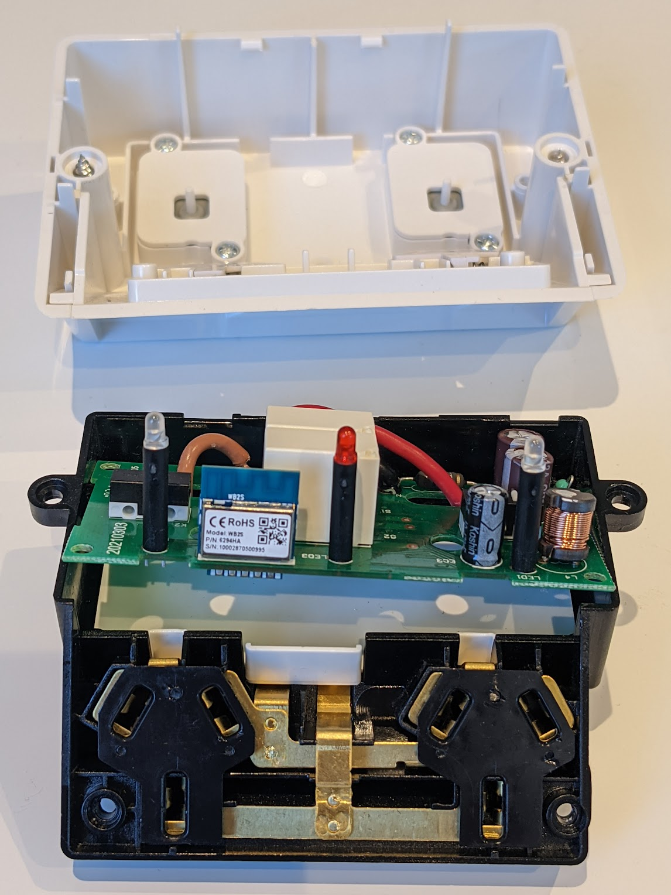
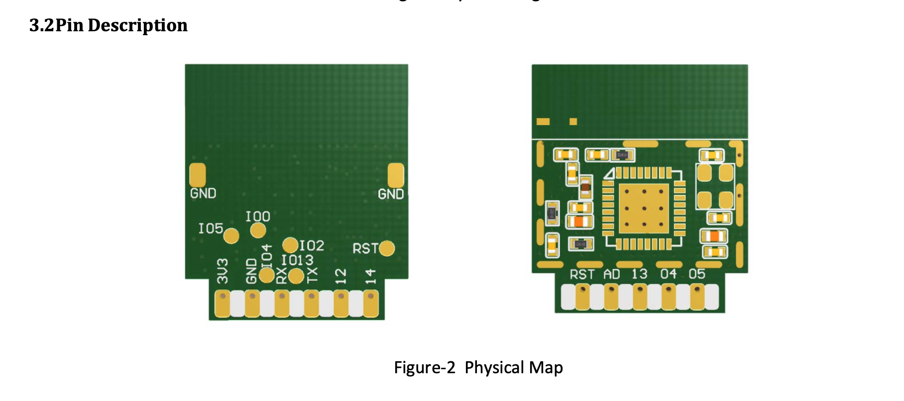
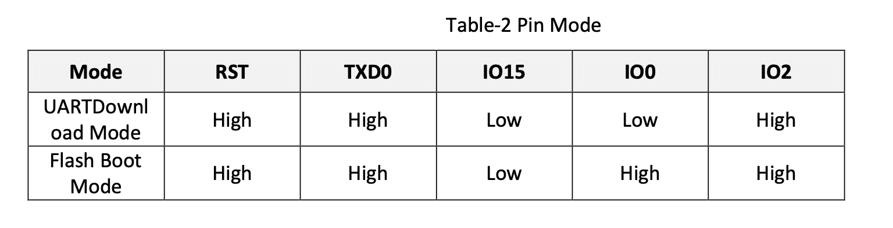
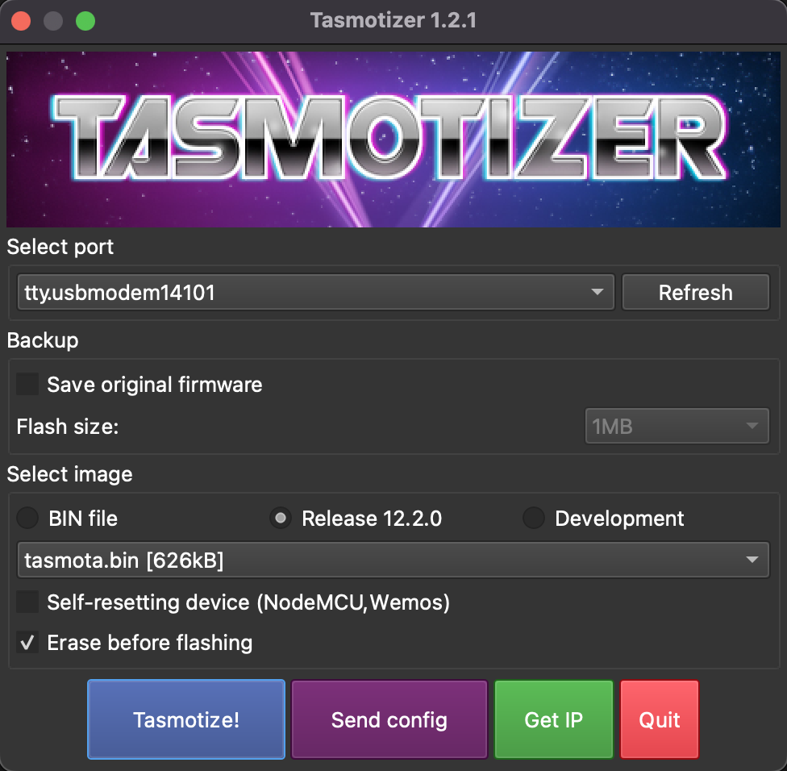
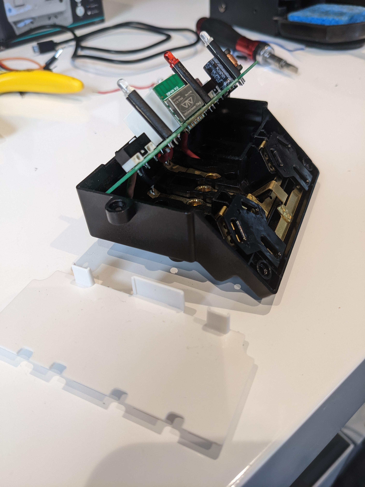
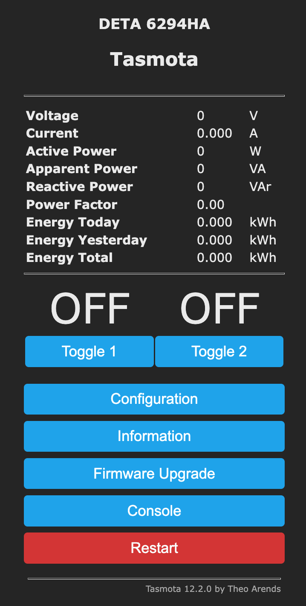

# Installing Tasmota on 6294HA
DETA outdoor IP54 weatherproof dual switch with energy meter, purchased from Bunnings https://www.bunnings.com.au/deta-grid-connect-smart-outdoor-double-powerpoint_p0172781.

## Method
Replacement of WB2S module with ESP-01N ESP8285.

## FAQs
 - Can tasmotizer flash an ESP-01N ESP8285 module? **Yes**
 - What version of tasmota has been proven? **v10.0.0**
 - Is the energy meter per-switch or summary for the device? **Summary for device only, does not provide per-switch resolution**

## Preperation
Need the following

- Replacement module, can be purchased from [alibaba](https://www.alibaba.com/product-detail/wholesale-original-factory-esp8285-wifi-module_1600312763169.html?spm=a2700.wholesale.0.0.bc372ed9HXXNDZ)
- Heatgun
- Solder paste
- FTDI programmer to flash module: https://www.dfrobot.com/product-581.html

## Process
Requires replacement of module as described here https://templates.blakadder.com/deta_6294HA.html. 

### Steps
1. Flash replacement module before soldering into unit
2. Use heatgun to remove existing module from unit
3. Install new module into unit with solder paste and heatgun
4. Configure template for Tasmota
5. Power calibrate
6. Install unit and test (by licensed electrician)

## 1. Flash replacement
The 6294HA contains a WB2S vertical mounted module. This needs to be replaced with an ESP-01N ESP8285 vertical mounted module which has proven successful. However, other chips can be used as described in https://templates.blakadder.com/deta_6294HA.html.

### 1.1. PinOuts
**Set the USB programmer to the following voltage: 3V3**

| Chip Side | Programmer | Notes |
| :---      | :---       | :---  |
| 3V3  | VCC  |       |
| GND  | GND  |       |
| RX   | TX   |       |
| TX   | RX   |       |
| IO0  | - | Keep LOW for powerup |
| IO15 | NC | Not required to be connected |
| IO2  | NC | Not required to be connected |

Taken from [ESP-01N datasheet](./WT-01N_datasheet.pdf)

<table>
<tr>
    <td>
        
    <td>
    <td>
        
    <td>
<tr>
</table>

- Solder wires onto the chip for each of the PINs requiring connection above. Place solder onto the pins and tin the connecting wire before soldering together.

### 1.2 Tasmotizer

- Run Tasmotizer (refer to https://github.com/tasmota/tasmotizer on how to install)
- Select USB port with tty 
- Download latest Tasmota binary (do not use lite version binary) using either release radio or locate image file locally
- Hit Tasmotize 
- Review log output and ensure 'hash of data is verified'

The following log will be displayed if successful

<pre>
esptool.py v2.8
Serial port /dev/tty.usbmodem14101
Connecting....
Chip is ESP8285
Features: WiFi, Embedded Flash
Crystal is 26MHz
Uploading stub...
Running stub...
Stub running...
Configuring flash size...
Auto-detected Flash size: 2MB
Erasing flash (this may take a while)...
Chip erase completed successfully in 2.8s
Flash params set to 0x0330
Compressed 641920 bytes to 457949...
Wrote 641920 bytes (457949 compressed) at 0x00000000 in 39.5 seconds (effective 129.9 kbit/s)...
Hash of data verified.

Leaving...
Hard resetting via RTS pin...
</pre>

### 1.3 Test Flashing Successful

To test tasmota has flashed successfully:

- Power up the chip with the programmer connected but ensure IO15 is set to high
- Search for a wifi SSID with a prefix `tasmota-` and connect laptop to it and the Tasmota web UI should display
- Enter the wifi network SSID and password into the web form for the desired network
- Tasmota will automatically reboot device and present the new IP on the desired network
- Open the IP in a webbrowser to observe the tasmota web UI

## 2. Using heatgun to remove module

- Remove screws to access PCB both internal and external - 8 in all.

## 3. Install new module

- Place solder paste on add pins and use heat gun to fix.

## 4. Configure template 

Get template from https://templates.blakadder.com/deta_6294HA.html

- Open up tasmota UI on device IP
- Select menu Configuration | Configure Other
- Paste template {} into other parameters and select activate, hit save
- Tasmota should reboot to the following UI

## 5. Power Calibrate

Based on https://tasmota.github.io/docs/Power-Monitoring-Calibration/

Plug a device with a known wattage into the switch e.g. lamp with known wattage.

Enter following via Tasmota UI console
<pre>
PowerSet 9.0 (dependent upon known wattage)
VoltageSet 240.0
CurrentSet 37.5 ( powerset / voltageset ) * 1000
</pre>

Check the power factor is a close to 1.0 as possible.
