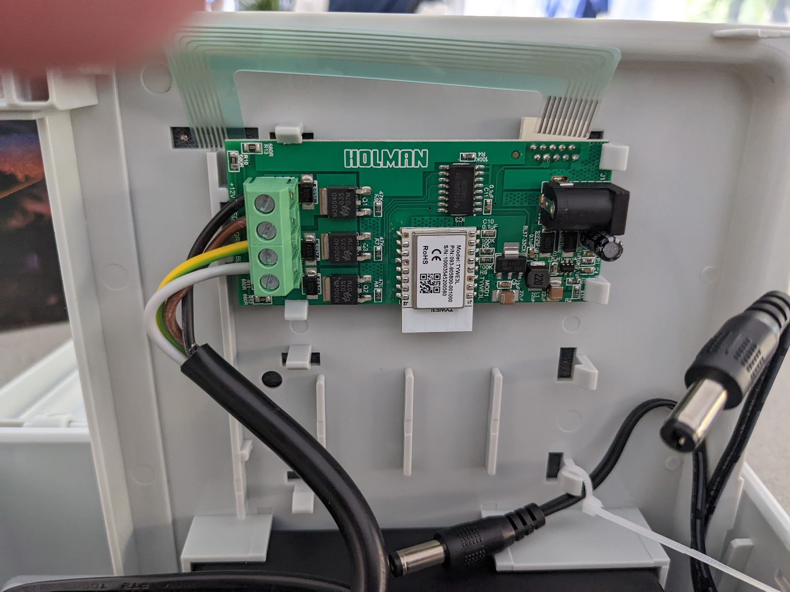
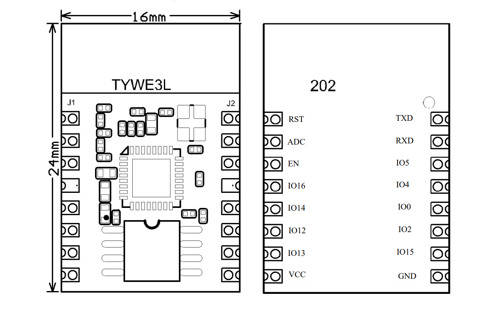
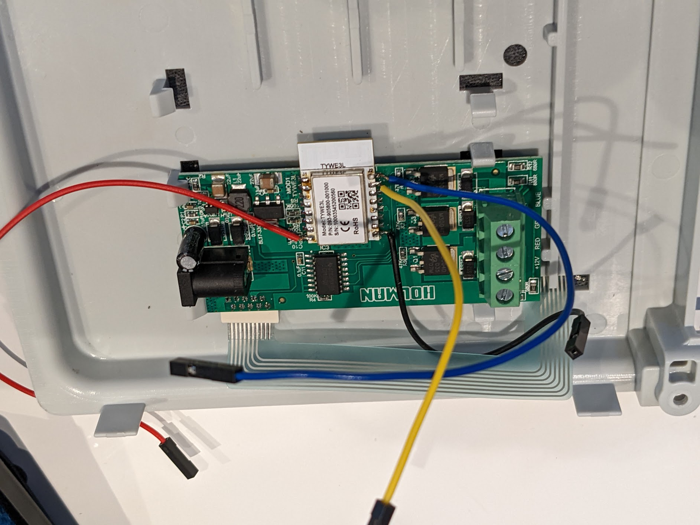

# Installing Tasmota on Holman Garden Light Controller CLXRGB60
Garden light controller to control colour and brightness of connected garden lights purchased from https://www.bunnings.com.au/holman-rgb-wi-fi-garden-light-controller_p0189462.

## Method
Flash in-place via soldered wires, uses TYWE3L module.

## FAQs
*the dumb questions you ask before starting*

## Preperation
*what's required to do the tasmotering?*

[Datasheet](./TYWE3L_datasheet.pdf) saved from https://fccid.io/2ANDL-TYWE3L/User-Manual/User-Manual-3894982.pdf

## Process

### Steps
1. Open up box and solder wires
2. Tasmotize
3. Configure template for Tasmota
4. Test

## 1. Soldering

Reference connectivity:

### 1.1. PinOuts
**Set the USB programmer to the following voltage: 3V3**

| Chip Side | Programmer | Notes |
| :---      | :---       | :---  |
| 3V3  | VCC  |       |
| GND  | GND  |       |
| RX   | TX   |       |
| TX   | RX   |       |
| IO0  | - | See below |
| RST  | - | See below |

Bring IO0 and RST momentarily at the sametime for 0.5 sec. This can be done by lightly touching the pin with wires connected to earth straight after hitting tasmotize.

## 2. Tasmotize

- Run Tasmotizer (refer to https://github.com/tasmota/tasmotizer on how to install)
- Select USB port with tty
- Download latest Tasmota binary (do not use lite binary version) using either release radio or locate image file locally
- Hit Tasmotize

## 3. Configure

## 4. Test
